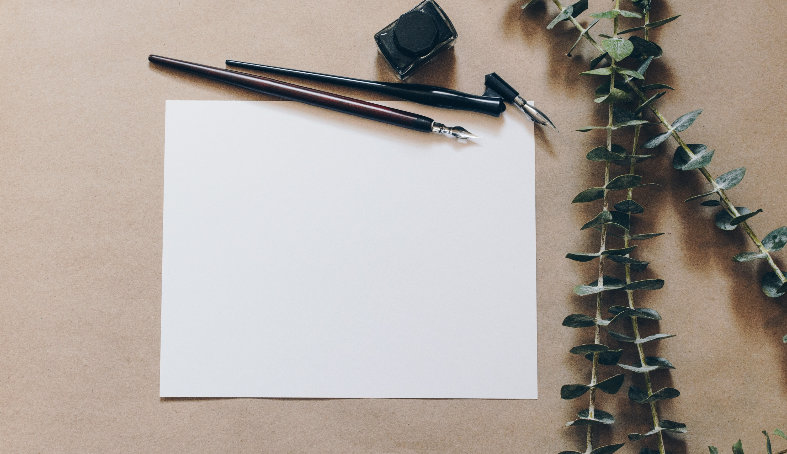

# Mediumesque
## Stylesheet for emulating Medium

# Introduction
This repot is for people who want to see how their document will look on Medium without having to use Medium.

## Example use-case

A writer wants to draft articles on their local disk in plain text, but wants to see how it would look on Medium before finalizing the text.

# Origin story

From [@philipkd](https://medium.com/@philipkd):
  
> I cannot write without the security of revision histories. When you write directly on Medium, there is always a paranoia that you'll accidentally delete what you wrote. I also like forking my documents as I explore different ideas. Plain-text provides the freedom I seek, and when paired with a good cloud backup service like Dropbox, I also have the security I need.
>
> However, once I transfer the text to Medium, I wind up with another revision phase, without the safeguards above. Furthermore, once I finish the document on Medium, the text there is out-of-sync with my local copy, which means that Medium is the final repository of my content. My preference is to keep plain text copies locally of everything I write.

# Status

This project is a work-in-progress, covering basic tags, such as headers and images. Images are currently just shown centered. Please expand and submit pull requests.

---

*Photo by [Kelly Sikkema](https://unsplash.com/photos/Oz_J_FXKvIs?utm_source=unsplash&utm_medium=referral&utm_content=creditCopyText) on [Unsplash](https://unsplash.com/search/photos/paper?utm_source=unsplash&utm_medium=referral&utm_content=creditCopyText)*